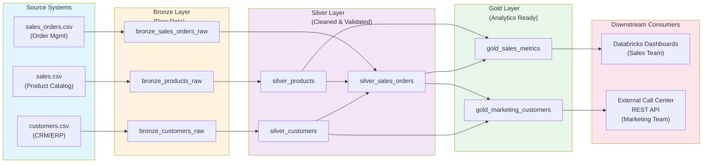

# Technical Design Document (TDD)
## Databricks ETL Sales Pipeline

**Project**: Sales & Marketing Data Processing Pipeline
**Target Catalog**: zoltan-verebes-catalog-m
**Target Schema**: dg-day
**Target Workspace**: https://dbc-59bc96e6-d850.cloud.databricks.com/
**Document Version**: 1.0
**Date**: 2026-02-20

---

## 1. Architecture Overview

### System Architecture Diagram



### Architecture Summary

**Medallion Architecture Implementation**:
- **Bronze Layer**: Raw, unmodified data ingested directly from source CSV files with minimal transformations (schema validation, metadata addition)
- **Silver Layer**: Cleaned, validated, and deduplicated data with data quality checks and standardization
- **Gold Layer**: Analytics-ready aggregated tables and customer profiles optimized for specific use cases (Sales Reporting and Marketing Campaigns)

---

## 2. Unity Catalog Structure

### Workspace Configuration

| Component | Value |
|-----------|-------|
| **Workspace URL** | https://dbc-59bc96e6-d850.cloud.databricks.com/ |
| **Catalog** | zoltan-verebes-catalog-m |
| **Schema** | dg-day |
| **Source Volume Path** | `/Volumes/zoltan-verebes-catalog-m/dg-day/volume/` |
| **Execution Environment** | Single (Development/Testing) |
| **Cluster Type** | Job Cluster (serverless for pipelines) |

### Naming Convention

**Pattern**: `{layer}_{domain}_{type}`

Where:
- **layer**: `bronze` | `silver` | `gold`
- **domain**: `customers` | `products` | `sales_orders`
- **type**: `raw` | `cleaned` | `fact` | `summary` (optional, defaults to raw for bronze)

**Examples**:
- `bronze_customers_raw` - Raw customer data from CSV
- `silver_customers` - Cleaned and deduplicated customer dimension
- `silver_products` - Cleaned product dimension
- `gold_sales_metrics` - Sales reporting fact table
- `gold_marketing_customers` - Customer profiles for marketing campaigns

### Schema Objects Summary

| Layer | Table Name | Purpose | Type | Retention |
|-------|-----------|---------|------|-----------|
| **Bronze** | bronze_customers_raw | Raw customer data + metadata | External | 30 days |
| **Bronze** | bronze_products_raw | Raw product catalog + metadata | External | 30 days |
| **Bronze** | bronze_sales_orders_raw | Raw sales orders + metadata | External | 30 days |
| **Silver** | silver_customers | Cleaned customers, deduplicated | Managed | 90 days |
| **Silver** | silver_products | Validated product catalog | Managed | 90 days |
| **Silver** | silver_sales_orders | Validated order details | Managed | 90 days |
| **Gold** | gold_sales_metrics | Aggregated sales metrics by product/category | Materialized View | 1 year |
| **Gold** | gold_marketing_customers | Customer profiles + behavioral metrics | Managed Table | 90 days |

---

## 3. Data Flow Summary

### Layer Responsibilities

#### Bronze Layer (Raw Ingestion)
- **Purpose**: Capture raw data from source systems with minimal transformation
- **Responsibility**:
  - Load CSV files with schema inference
  - Add ingestion metadata (load_timestamp, source_file, record_count)
  - Preserve data lineage for audit trail
  - Add `_load_id` and `_load_date` for tracking
- **Data Quality**: Schema validation, file format checks
- **Processing**: Batch ingestion (manual trigger)

#### Silver Layer (Cleansing & Validation)
- **Purpose**: Provide cleaned, validated, deduplicated data as foundation for analytics
- **Responsibility**:
  - Remove duplicates based on business keys
  - Standardize data formats (email, phone, dates)
  - Validate data constraints (data types, nullability, referential integrity)
  - Enrich data (e.g., timezone from state)
  - Filter invalid records to quarantine table
  - Calculate data quality metrics
- **Data Quality**:
  - Null validation, type validation
  - Referential integrity checks (order→customer, order→product)
  - Business rule validation
- **Processing**: Incremental or full refresh based on source update patterns

#### Gold Layer (Analytics Ready)
- **Purpose**: Provide optimized, aggregated tables for specific use cases
- **Responsibility**:
  - **gold_sales_metrics**: Aggregate order metrics by product/category/time dimension
    - Remove all PII (customer names, emails, phone)
    - Pre-aggregate daily/weekly/monthly/annual summaries
  - **gold_marketing_customers**: Denormalized customer profiles with behavioral data
    - Include customer contact info (name, email, phone, address)
    - Include calculated metrics (total_orders, total_spend, last_purchase_date)
    - Include product category preferences
    - Filter: only include customers with valid email OR phone
    - Enrich: include timezone information
- **Data Quality**: Aggregate validation, row-count reconciliation
- **Processing**: Materialized views for sales metrics, managed tables for customer profiles

---

## 4. Data Sources

### 4.1 Source System Details

#### Entity 1: customers.csv

**Source Location**: `/Volumes/zoltan-verebes-catalog-m/dg-day/volume/customers.csv`

**Characteristics**:
| Attribute | Value |
|-----------|-------|
| Format | CSV (comma-delimited) |
| Size | ~5-10 MB |
| Records | ~10,000s |
| Header | Yes |
| Encoding | UTF-8 |
| Update Frequency | Manual, infrequent, unreliable |

**Sample Data**:
```
customer_id,tax_id,tax_code,customer_name,state,city,postcode,street,number,unit,region,district,lon,lat,ship_to_address,valid_from,valid_to,units_purchased,loyalty_segment
15405283,NULL,NULL,"DELVALLE,  HENRY",CA,BAKERSFIELD,93311,"LOCKSLEY DR",12502,NULL,CA,NULL,-119.142,35.3362,"CA, 93311.0, LOCKSLEY DR, 12502",1536302672,NULL,9,2
32784453,NULL,NULL,"MAHER,  ZACHARY",WA,"Gig Harbor",98335,"47TH ST NW",2213,"#D201",WA,NULL,-122.57,47.3002,"WA, 98335, 47TH ST NW, 2213",1541600046,NULL,16,3
14252735,NULL,NULL,"GONZALEZ,  JESSICA",OH,"GROVE CITY",43123,"SIMMONS DR",3465,NULL,OH,FRA,-83.0657,39.8927,"OH, 43123.0, SIMMONS DR, 3465",1532997029,NULL,4,0
17856145,NULL,NULL,"ROBINSON,  GEORGE M",NY,Gloversville,12078,"South Main Street",253,"Apartment 2",NY,Fulton,-74.3525,43.0427,"NY, 12078, South Main Street, 253",1545167113,1553147568,3,0
17522057,544706818,A,"hipro feeds",CA,"PALO ALTO",94306,"LOMA VERDE AVE",451,NULL,NULL,NULL,-122.126,37.4269,"CA, 94306, LOMA VERDE AVE, 451",1519956301,NULL,161,3
```

**Schema Definition**:

| Column | Data Type | Nullable | Constraints | PII Classification | Notes |
|--------|-----------|----------|-------------|-------------------|-------|
| customer_id | BIGINT | NO | PRIMARY KEY, Unique | Non-PII | Customer unique identifier |
| tax_id | STRING | YES | Tax registration number | **PII** | Business tax ID (if B2B) |
| tax_code | STRING | YES | Tax classification code | Non-PII | Tax jurisdiction code |
| customer_name | STRING | NO | Max length 200 | **PII** | Customer name (individual or business) |
| state | STRING | YES | US state code (2-char) | Non-PII | State for timezone mapping |
| city | STRING | YES | Max length 100 | **PII** | City name |
| postcode | STRING | YES | ZIP code | **PII** | Postal/ZIP code |
| street | STRING | YES | Max length 150 | **PII** | Street name |
| number | BIGINT | YES | House/building number | **PII** | Street number |
| unit | STRING | YES | Apartment/suite number | **PII** | Address unit |
| region | STRING | YES | Geographic region | Non-PII | Region code |
| district | STRING | YES | District/county | **PII** | Administrative district |
| lon | DECIMAL(10,5) | YES | Longitude coordinate | Non-PII | Geographic longitude |
| lat | DECIMAL(10,5) | YES | Latitude coordinate | Non-PII | Geographic latitude |
| ship_to_address | STRING | YES | Formatted address | **PII** | Full shipping address |
| valid_from | BIGINT | YES | Unix timestamp | Non-PII | Record effective date |
| valid_to | BIGINT | YES | Unix timestamp | Non-PII | Record expiration date |
| units_purchased | BIGINT | YES | >= 0 | Non-PII | Total units purchased by customer |
| loyalty_segment | BIGINT | YES | Loyalty tier (0-5) | Non-PII | Customer loyalty classification |

**PySpark Read Code**:
```python
customers_df = spark.read.format("csv") \
    .option("header", "true") \
    .option("inferSchema", "true") \
    .option("multiline", "true") \
    .option("escape", "\"") \
    .load("/Volumes/zoltan-verebes-catalog-m/dg-day/volume/customers.csv")
```

---

#### Entity 2: sales.csv (Orders with Product Info)

**Source Location**: `/Volumes/zoltan-verebes-catalog-m/dg-day/volume/sales.csv`

**Characteristics**:
| Attribute | Value |
|-----------|-------|
| Format | CSV (comma-delimited) |
| Size | ~50-100 MB |
| Records | ~100,000s |
| Header | Yes |
| Encoding | UTF-8, includes JSON fields |
| Update Frequency | Manual, infrequent, unreliable |

**Sample Data**:
```
customer_id,customer_name,product_name,order_date,product_category,product,total_price
24633905,"VASQUEZ,  YVONNE M","HT-XT2 170W 2.1-Channel TV Speaker Base (Black)",2020-02-28,Rony,"{""curr"":""USD"", ""id"":""AVpgIKYELJeJML43JV9V"",...}",125.99
24633905,"VASQUEZ,  YVONNE M","Opple MD825AM/A Lightning to VGA Adapter for iPhones",2019-09-24,Opple,"{""curr"":""USD"", ""id"":""AVpggL_W1cnluZ0-2Wfp"",...}",39.99
31375543,"ab digital, llc","Opple NakBook - 12 - Core m5 - 8 GB RAM - 512 GB flash storage",2019-08-16,Opple,"{""curr"":""USD"", ""id"":""AVpf-2hGilAPnD_xlfDv"",...}",1299.99
```

**Schema Definition**:

| Column | Data Type | Nullable | Constraints | PII Classification | Notes |
|--------|-----------|----------|-------------|-------------------|-------|
| customer_id | BIGINT | NO | FOREIGN KEY → customers(customer_id) | Non-PII | Reference to customer |
| customer_name | STRING | NO | Max length 200 | **PII** | Customer name (denormalized) |
| product_name | STRING | NO | Max length 300 | Non-PII | Product display name |
| order_date | DATE | NO | No future dates | Non-PII | Date order was placed |
| product_category | STRING | NO | Category name | Non-PII | Product category for segmentation |
| product | STRING | YES | JSON string | Non-PII | Product metadata as JSON (currency, ID, etc.) |
| total_price | DECIMAL(12,2) | NO | >= 0 | Non-PII | Total order amount |

**Notes on data structure**:
- This file contains ORDER-level data, not a separate product catalog
- `product` column contains JSON-formatted metadata
- No separate product_id column; product identity tracked in JSON
- Customer and product info are denormalized into single record

**PySpark Read Code**:
```python
sales_df = spark.read.format("csv") \
    .option("header", "true") \
    .option("inferSchema", "true") \
    .option("multiline", "true") \
    .option("escape", "\"") \
    .load("/Volumes/zoltan-verebes-catalog-m/dg-day/volume/sales.csv")
```

---

#### Entity 3: sales_orders.csv (Order Details & Interactions)

**Source Location**: `/Volumes/zoltan-verebes-catalog-m/dg-day/volume/sales_orders.csv`

**Characteristics**:
| Attribute | Value |
|-----------|-------|
| Format | CSV (comma-delimited) |
| Size | ~20-50 MB |
| Records | ~10,000s |
| Header | Yes |
| Encoding | UTF-8, includes JSON arrays |
| Update Frequency | Manual, infrequent, unreliable |

**Sample Data** (formatted for readability):
```
clicked_items,customer_id,customer_name,number_of_line_items,order_datetime,order_number,ordered_products,promo_info
"[[""AVpg-Wj61cnluZ0-8sZe"", ""78""], [""AVpfIODe1cnluZ0-eg35"", ""37""]]",15405283,"DELVALLE, HENRY",2,"2020-02-28 10:15:30",O001,"[[""AVz5wc0H-jtxr-f30F6_"", ""61""]]","PROMO_CODE_XYZ"
"[[""AVpfeG5oilAPnD_xcTsG"", ""47""]]",32784453,"MAHER, ZACHARY",1,"2019-09-24 14:22:15",O002,"[[""AVpfSYlFLJeJML436UdP"", ""90""]]","NONE"
```

**Schema Definition**:

| Column | Data Type | Nullable | Constraints | PII Classification | Notes |
|--------|-----------|----------|-------------|-------------------|-------|
| clicked_items | STRING | YES | JSON array format | Non-PII | Product IDs/counts customer clicked on (JSON array) |
| customer_id | BIGINT | NO | FOREIGN KEY → customers(customer_id) | Non-PII | Reference to customer |
| customer_name | STRING | YES | Max length 200 | **PII** | Customer name (denormalized) |
| number_of_line_items | BIGINT | NO | > 0 | Non-PII | Count of items in order |
| order_datetime | STRING | NO | Timestamp format | Non-PII | Date and time order was placed |
| order_number | STRING | NO | Unique order identifier | Non-PII | Order reference number |
| ordered_products | STRING | YES | JSON array format | Non-PII | Product IDs/quantities ordered (JSON array) |
| promo_info | STRING | YES | Promo code or "NONE" | Non-PII | Promotion code applied |

**Notes on data structure**:
- `clicked_items` and `ordered_products` are JSON arrays (not relational normalization)
- Arrays contain product IDs paired with quantities/counts
- This is an order header + interaction tracking table
- Customer info is denormalized
- May require JSON parsing in silver layer to normalize

**PySpark Read Code**:
```python
orders_df = spark.read.format("csv") \
    .option("header", "true") \
    .option("inferSchema", "true") \
    .option("multiline", "true") \
    .option("escape", "\"") \
    .load("/Volumes/zoltan-verebes-catalog-m/dg-day/volume/sales_orders.csv")
```

---

### 4.2 Data Quality Expectations

| Entity | Known Issues | Handling Strategy |
|--------|--------------|-------------------|
| customers.csv | Duplicate customer_ids, Missing emails/phones | Deduplicate by customer_id, Allow nulls for email/phone |
| sales.csv | Inconsistent category values, Prices as strings | Standardize category taxonomy, Cast price to DECIMAL |
| sales_orders.csv | Orphaned orders (customer/product not in master), Invalid dates | Quarantine orphaned orders, Validate date ranges |

---

## 5. Unity Catalog Object Definitions

### 5.1 Bronze Layer Tables

#### bronze_customers_raw

```sql
CREATE EXTERNAL TABLE zoltan-verebes-catalog-m.dg-day.bronze_customers_raw (
    customer_id BIGINT COMMENT "Unique customer identifier (PK)",
    tax_id STRING COMMENT "Tax registration number (B2B customers)",
    tax_code STRING COMMENT "Tax jurisdiction code",
    customer_name STRING COMMENT "Customer full name or business name",
    state STRING COMMENT "US state code (2-character)",
    city STRING COMMENT "City name",
    postcode STRING COMMENT "ZIP/postal code",
    street STRING COMMENT "Street name",
    number BIGINT COMMENT "House/building number",
    unit STRING COMMENT "Apartment/suite number",
    region STRING COMMENT "Geographic region code",
    district STRING COMMENT "Administrative district",
    lon DECIMAL(10,5) COMMENT "Longitude coordinate",
    lat DECIMAL(10,5) COMMENT "Latitude coordinate",
    ship_to_address STRING COMMENT "Formatted shipping address",
    valid_from BIGINT COMMENT "Record effective date (Unix timestamp)",
    valid_to BIGINT COMMENT "Record expiration date (Unix timestamp)",
    units_purchased BIGINT COMMENT "Total units purchased by customer",
    loyalty_segment BIGINT COMMENT "Loyalty tier classification (0-5)",
    _load_id STRING COMMENT "Unique load identifier for audit trail",
    _load_timestamp TIMESTAMP COMMENT "When record was loaded",
    _source_file STRING COMMENT "Source filename",
    _load_row_count BIGINT COMMENT "Total records in source file"
)
USING DELTA
LOCATION '/Volumes/zoltan-verebes-catalog-m/dg-day/bronze/customers/'
COMMENT "Raw customer data from customers.csv with ingestion metadata"
TBLPROPERTIES (
    'delta.autoOptimize.optimizeWrite' = 'true',
    'delta.autoOptimize.autoCompact' = 'true',
    'owner' = 'data_engineering',
    'pii_data' = 'true',
    'domain' = 'customers',
    'layer' = 'bronze'
)
```

**Column Classifications**:
- **PII Columns**: customer_name, city, postcode, street, number, unit, district, ship_to_address, tax_id
- **Non-PII Columns**: customer_id, state, region, lon, lat, loyalty_segment, units_purchased, tax_code, _load_* columns

**Tags**: `PII`, `Confidential`, `Customers`

---

#### bronze_sales_raw (Orders with Product Info)

```sql
CREATE EXTERNAL TABLE zoltan-verebes-catalog-m.dg-day.bronze_sales_raw (
    customer_id BIGINT COMMENT "Reference to customer",
    customer_name STRING COMMENT "Customer name (denormalized from order)",
    product_name STRING COMMENT "Product display name",
    order_date DATE COMMENT "Date order was placed",
    product_category STRING COMMENT "Product category for segmentation",
    product STRING COMMENT "Product metadata as JSON string",
    total_price DECIMAL(12,2) COMMENT "Total order amount",
    _load_id STRING COMMENT "Unique load identifier for audit trail",
    _load_timestamp TIMESTAMP COMMENT "When record was loaded",
    _source_file STRING COMMENT "Source filename",
    _load_row_count BIGINT COMMENT "Total records in source file"
)
USING DELTA
LOCATION '/Volumes/zoltan-verebes-catalog-m/dg-day/bronze/sales/'
COMMENT "Raw sales orders from sales.csv with ingestion metadata"
TBLPROPERTIES (
    'delta.autoOptimize.optimizeWrite' = 'true',
    'delta.autoOptimize.autoCompact' = 'true',
    'owner' = 'data_engineering',
    'pii_data' = 'true',
    'domain' = 'sales',
    'layer' = 'bronze'
)
```

**Column Classifications**:
- **PII Columns**: customer_name
- **Non-PII Columns**: customer_id, product_name, product_category, product (JSON), order_date, total_price, _load_* columns

**Tags**: `Public`, `Sales`, `Orders`

---

#### bronze_sales_orders_raw (Order Details & Interactions)

```sql
CREATE EXTERNAL TABLE zoltan-verebes-catalog-m.dg-day.bronze_sales_orders_raw (
    clicked_items STRING COMMENT "Product IDs clicked (JSON array format)",
    customer_id BIGINT COMMENT "Reference to customer (FK)",
    customer_name STRING COMMENT "Customer name (denormalized)",
    number_of_line_items BIGINT COMMENT "Count of items in order",
    order_datetime STRING COMMENT "Date and time order was placed",
    order_number STRING COMMENT "Order reference number (PK)",
    ordered_products STRING COMMENT "Product IDs ordered (JSON array format)",
    promo_info STRING COMMENT "Promotion code applied or 'NONE'",
    _load_id STRING COMMENT "Unique load identifier for audit trail",
    _load_timestamp TIMESTAMP COMMENT "When record was loaded",
    _source_file STRING COMMENT "Source filename",
    _load_row_count BIGINT COMMENT "Total records in source file"
)
USING DELTA
LOCATION '/Volumes/zoltan-verebes-catalog-m/dg-day/bronze/sales_orders/'
COMMENT "Raw sales order details from sales_orders.csv with ingestion metadata"
TBLPROPERTIES (
    'delta.autoOptimize.optimizeWrite' = 'true',
    'delta.autoOptimize.autoCompact' = 'true',
    'owner' = 'data_engineering',
    'pii_data' = 'true',
    'domain' = 'sales_orders',
    'layer' = 'bronze'
)
```

**Column Classifications**:
- **PII Columns**: customer_name
- **Non-PII Columns**: clicked_items, customer_id, number_of_line_items, order_datetime, order_number, ordered_products, promo_info, _load_* columns

**Notes**:
- `clicked_items` and `ordered_products` are JSON arrays that will require parsing in silver layer
- This file contains order-level interaction data
- May need to unnest JSON arrays for normalized storage

**Tags**: `PII`, `Orders`, `Sales`

---

### 5.2 Silver Layer Tables

#### silver_customers

```sql
CREATE TABLE zoltan-verebes-catalog-m.dg-day.silver_customers (
    customer_id STRING NOT NULL COMMENT "Unique customer identifier (PK)",
    name STRING NOT NULL COMMENT "Customer full name",
    email STRING COMMENT "Standardized email address (valid format or NULL)",
    phone STRING COMMENT "Standardized phone number (valid format or NULL)",
    address STRING COMMENT "Street address",
    city STRING COMMENT "City name",
    state STRING COMMENT "US state code (2-character)",
    timezone STRING COMMENT "Timezone derived from state",
    is_valid BOOLEAN COMMENT "Record passed all quality checks",
    dq_notes STRING COMMENT "Data quality issues found (if any)",
    _has_contact_method BOOLEAN COMMENT "TRUE if email OR phone is present",
    _silver_load_id STRING COMMENT "Load identifier from silver processing",
    _silver_timestamp TIMESTAMP COMMENT "When record was processed to silver",
    _bronze_load_id STRING COMMENT "Bronze load identifier (lineage)",
    PRIMARY KEY (customer_id)
)
USING DELTA
COMMENT "Cleaned, deduplicated customer dimension"
TBLPROPERTIES (
    'delta.autoOptimize.optimizeWrite' = 'true',
    'delta.autoOptimize.autoCompact' = 'true',
    'owner' = 'data_engineering',
    'pii_data' = 'true',
    'domain' = 'customers',
    'layer' = 'silver'
)
```

**Data Quality Rules Applied**:
1. Deduplicate by customer_id (keep latest by _load_timestamp)
2. Email standardization: lowercase, validate format
3. Phone standardization: remove formatting, validate 10-digit pattern
4. Timezone enrichment from state codes (mapping table)
5. Flag records with missing required fields

**Tags**: `PII`, `Confidential`, `Customers`, `Cleaned`

---

#### silver_products

```sql
CREATE TABLE zoltan-verebes-catalog-m.dg-day.silver_products (
    product_id STRING NOT NULL COMMENT "Unique product identifier (PK)",
    product_name STRING NOT NULL COMMENT "Product display name",
    category STRING NOT NULL COMMENT "Standardized product category",
    price DECIMAL(10,2) NOT NULL COMMENT "Unit price (USD)",
    availability_status STRING NOT NULL COMMENT "IN_STOCK, OUT_OF_STOCK, DISCONTINUED",
    is_valid BOOLEAN COMMENT "Record passed all quality checks",
    dq_notes STRING COMMENT "Data quality issues found (if any)",
    _silver_load_id STRING COMMENT "Load identifier from silver processing",
    _silver_timestamp TIMESTAMP COMMENT "When record was processed to silver",
    _bronze_load_id STRING COMMENT "Bronze load identifier (lineage)",
    PRIMARY KEY (product_id)
)
USING DELTA
COMMENT "Validated product catalog with standardized categories"
TBLPROPERTIES (
    'delta.autoOptimize.optimizeWrite' = 'true',
    'delta.autoOptimize.autoCompact' = 'true',
    'owner' = 'data_engineering',
    'pii_data' = 'false',
    'domain' = 'products',
    'layer' = 'silver'
)
```

**Data Quality Rules Applied**:
1. Category standardization (map synonyms to canonical values)
2. Price validation (must be > 0)
3. Availability status validation (allowed values: IN_STOCK, OUT_OF_STOCK, DISCONTINUED)
4. Deduplication by product_id

**Tags**: `Public`, `Products`, `Cleaned`

---

#### silver_sales_orders

```sql
CREATE TABLE zoltan-verebes-catalog-m.dg-day.silver_sales_orders (
    order_id STRING NOT NULL COMMENT "Unique order identifier (PK)",
    customer_id STRING NOT NULL COMMENT "Reference to customer (FK)",
    product_id STRING NOT NULL COMMENT "Reference to product (FK)",
    order_date DATE NOT NULL COMMENT "Date order was placed",
    quantity INTEGER NOT NULL COMMENT "Units ordered (> 0)",
    order_status STRING NOT NULL COMMENT "PENDING, COMPLETED, CANCELLED, RETURNED",
    order_amount DECIMAL(12,2) NOT NULL COMMENT "Total order value",
    is_valid BOOLEAN COMMENT "Record passed all quality checks",
    dq_notes STRING COMMENT "Data quality issues found (if any)",
    _referential_integrity_ok BOOLEAN COMMENT "Customer and product references exist",
    _silver_load_id STRING COMMENT "Load identifier from silver processing",
    _silver_timestamp TIMESTAMP COMMENT "When record was processed to silver",
    _bronze_load_id STRING COMMENT "Bronze load identifier (lineage)",
    PRIMARY KEY (order_id),
    FOREIGN KEY (customer_id) REFERENCES silver_customers(customer_id),
    FOREIGN KEY (product_id) REFERENCES silver_products(product_id)
)
USING DELTA
COMMENT "Validated sales orders with referential integrity checks"
TBLPROPERTIES (
    'delta.autoOptimize.optimizeWrite' = 'true',
    'delta.autoOptimize.autoCompact' = 'true',
    'owner' = 'data_engineering',
    'pii_data' = 'false',
    'domain' = 'sales_orders',
    'layer' = 'silver'
)
```

**Data Quality Rules Applied**:
1. Referential integrity validation (customer_id exists in silver_customers, product_id exists in silver_products)
2. Quantity validation (must be > 0)
3. Order date validation (no future dates, reasonable historical range)
4. Order status validation (allowed values: PENDING, COMPLETED, CANCELLED, RETURNED)
5. Order amount validation (must match quantity * product price)

**Tags**: `Public`, `Orders`, `Sales`, `Cleaned`

---

### 5.3 Gold Layer Objects

#### gold_sales_metrics (Materialized View)

```sql
CREATE MATERIALIZED VIEW zoltan-verebes-catalog-m.dg-day.gold_sales_metrics AS
SELECT
    -- Date dimensions
    sso.order_date AS sale_date,
    YEAR(sso.order_date) AS year,
    QUARTER(sso.order_date) AS quarter,
    MONTH(sso.order_date) AS month,
    WEEK(sso.order_date) AS week,

    -- Product dimensions
    sp.product_id,
    sp.product_name,
    sp.category AS product_category,

    -- Aggregated metrics
    COUNT(DISTINCT sso.order_id) AS order_count,
    SUM(sso.quantity) AS total_quantity_sold,
    SUM(sso.order_amount) AS total_revenue,
    AVG(sso.order_amount) AS avg_order_value,
    MIN(sso.order_date) AS first_order_date,
    MAX(sso.order_date) AS last_order_date,

    -- Data quality
    COUNT(*) AS record_count,
    CURRENT_TIMESTAMP() AS last_refresh
FROM zoltan-verebes-catalog-m.dg-day.silver_sales_orders sso
INNER JOIN zoltan-verebes-catalog-m.dg-day.silver_products sp
    ON sso.product_id = sp.product_id
WHERE sso.is_valid = TRUE
  AND sso.order_status = 'COMPLETED'
GROUP BY
    sso.order_date, YEAR(sso.order_date), QUARTER(sso.order_date),
    MONTH(sso.order_date), WEEK(sso.order_date),
    sp.product_id, sp.product_name, sp.category
COMMENT "Aggregated sales metrics by product/category/time (NO PII)"
TBLPROPERTIES (
    'owner' = 'sales_analytics',
    'pii_data' = 'false',
    'domain' = 'sales_metrics',
    'layer' = 'gold',
    'refresh_interval' = 'daily',
    'use_case' = 'Sales Reporting (FR-16, FR-18, FR-19)'
)
```

**Purpose**: Support sales reporting use case with aggregated metrics

**Access**: Sales team (no PII included)

**Refresh Strategy**: Materialized view refreshed daily (or after each silver layer update)

**Tags**: `Public`, `Analytics`, `Sales`

---

#### gold_marketing_customers (Managed Table)

```sql
CREATE TABLE zoltan-verebes-catalog-m.dg-day.gold_marketing_customers AS
SELECT
    sc.customer_id,
    sc.name,
    sc.email,
    sc.phone,
    sc.address,
    sc.city,
    sc.state,
    sc.timezone,

    -- Customer behavioral metrics
    COUNT(DISTINCT sso.order_id) AS total_orders,
    SUM(sso.order_amount) AS total_spend,
    MAX(sso.order_date) AS last_purchase_date,
    DATEDIFF(CURRENT_DATE, MAX(sso.order_date)) AS days_since_last_purchase,

    -- Product category preferences
    COLLECT_SET(sp.category) AS preferred_categories,

    -- Contact method availability
    CASE
        WHEN sc.email IS NOT NULL OR sc.phone IS NOT NULL THEN TRUE
        ELSE FALSE
    END AS has_valid_contact,

    -- Enrichment flags
    CASE WHEN sc.timezone IS NOT NULL THEN TRUE ELSE FALSE END AS has_timezone,

    -- Metadata
    CURRENT_TIMESTAMP() AS last_refresh,
    sc._silver_timestamp AS silver_last_update
FROM zoltan-verebes-catalog-m.dg-day.silver_customers sc
LEFT JOIN zoltan-verebes-catalog-m.dg-day.silver_sales_orders sso
    ON sc.customer_id = sso.customer_id AND sso.is_valid = TRUE
LEFT JOIN zoltan-verebes-catalog-m.dg-day.silver_products sp
    ON sso.product_id = sp.product_id
WHERE (sc.email IS NOT NULL OR sc.phone IS NOT NULL)  -- Only include customers with contact method
  AND sc.is_valid = TRUE
GROUP BY
    sc.customer_id, sc.name, sc.email, sc.phone, sc.address,
    sc.city, sc.state, sc.timezone, sc._silver_timestamp
COMMENT "Customer profiles with behavioral metrics and contact information for marketing"
TBLPROPERTIES (
    'owner' = 'marketing_analytics',
    'pii_data' = 'true',
    'domain' = 'marketing_customers',
    'layer' = 'gold',
    'refresh_interval' = 'weekly',
    'use_case' = 'Marketing Campaigns (FR-20, FR-21, FR-22, FR-23, FR-24)'
)
```

**Purpose**: Support marketing campaigns with customer profiles and behavioral data

**Filtering Rules**:
- Only include customers with valid email OR phone number (FR-21, FR-15)
- Only include customers with is_valid = TRUE

**Enrichment Applied**:
- Timezone from state code (FR-11, FR-23)
- Product category preferences (FR-24)
- Behavioral metrics (FR-9, FR-22)

**Access**: Marketing team only (includes PII)

**Refresh Strategy**: Refresh weekly (or on-demand)

**Tags**: `PII`, `Confidential`, `Marketing`, `Analytics`

---

## 6. Medallion Architecture Implementation

### 6.1 Overall Implementation Strategy

**Development Framework**: Delta Live Tables (DLT) with SQL and PySpark
**Language**: SQL (primary), PySpark for complex transformations
**Source Control**: Git with infrastructure-as-code in `databricks.yml`
**Testing**: Unit tests for transformation logic

---

### 6.2 Bronze Layer - Data Ingestion

#### 6.2.0 Metadata Columns for Audit Trail & Lineage

Every bronze table includes metadata columns to track data provenance and enable debugging:

| Column | Purpose | Example | Use Case |
|--------|---------|---------|----------|
| `_load_id` | Unique identifier for each ingestion run | `load_20260220_143022_abc123` | Group records from same batch; identify which pipeline execution created data |
| `_load_timestamp` | When data was loaded into bronze | `2026-02-20 14:30:22` | Track ingestion time; identify latest version in deduplication; data freshness validation |
| `_source_file` | Original filename | `customers.csv` | Trace data origin; audit which source was loaded |
| `_load_row_count` | Total records in source file | `42500` | Validate completeness; detect truncated files; track volume trends |

**Why These Matter**:
- **Data Lineage**: Answer "where did this record come from and when?"
- **Debugging**: If data quality issue detected in gold layer, trace back to which bronze load caused it
- **Deduplication**: In silver layer, use `_load_timestamp` to keep latest version of duplicate records
- **Compliance**: Audit trail for regulatory requirements

**Example Flow**:
```
Bronze (raw data with metadata):
customer_id | name    | _load_id                    | _load_timestamp
C001        | John    | load_20260220_143022_abc123 | 2026-02-20 14:30:22
C001        | John    | load_20260220_093015_def456 | 2026-02-20 09:30:15  (older)

Silver (after deduplication - keeps latest):
customer_id | name    | _bronze_load_id             | _silver_timestamp
C001        | John    | load_20260220_143022_abc123 | 2026-02-20 14:35:10  (kept latest)
```

---

#### 6.2.1 Ingestion Pipeline Design

**Purpose**: Load raw CSV data with minimal transformation, add metadata for lineage tracking

**Implementation Location**: `src/sales_project/pipelines/bronze_ingestion.py`

**Key Tasks**:
1. Load CSV with schema inference
2. Validate file format and row counts
3. Add ingestion metadata columns
4. Create quarantine table for invalid records
5. Log ingestion metrics

**Pseudo-code**:
```python
# File: src/sales_project/pipelines/bronze_ingestion.py
import pyspark.sql.functions as F
from pyspark.sql.types import *
from datetime import datetime

def ingest_customers(spark, source_path, load_id):
    """Ingest customers.csv to bronze layer"""
    # Read with schema inference
    df = spark.read.format("csv") \
        .option("header", "true") \
        .option("inferSchema", "true") \
        .load(f"{source_path}/customers.csv")

    # Add metadata
    load_timestamp = F.current_timestamp()
    df = df.withColumn("_load_id", F.lit(load_id)) \
        .withColumn("_load_timestamp", load_timestamp) \
        .withColumn("_source_file", F.lit("customers.csv")) \
        .withColumn("_load_row_count", F.lit(df.count()))

    # Write to bronze layer
    df.write.format("delta") \
        .mode("overwrite") \
        .option("mergeSchema", "true") \
        .saveAsTable("bronze_customers_raw")

    return df.count()

def ingest_products(spark, source_path, load_id):
    """Ingest sales.csv (products) to bronze layer"""
    # Similar to ingest_customers
    pass

def ingest_orders(spark, source_path, load_id):
    """Ingest sales_orders.csv to bronze layer"""
    # Similar to ingest_customers
    pass
```

---

### 6.3 Silver Layer - Data Cleaning & Validation

#### 6.3.1 Data Cleaning Expectations & Defaults

| Entity | Field | Cleaning Rule | Default | Validation |
|--------|-------|---|---------|-----------|
| customers | email | Lowercase, trim spaces | NULL | Email regex: `^[^\s@]+@[^\s@]+\.[^\s@]+$` |
| customers | phone | Remove formatting, keep digits | NULL | Length 10, numeric only |
| customers | name | Trim spaces, fix case | Keep as-is | Not nullable if present |
| customers | state | Convert to uppercase | NULL | US state code (2-char) |
| products | category | Standardize to canonical values | UNKNOWN | Must match taxonomy |
| products | price | Cast to DECIMAL(10,2) | 0.00 | >= 0.00 |
| orders | order_date | Parse date format | NULL | Valid date, not future |
| orders | quantity | Cast to INT | 0 | > 0 |

#### 6.3.2 Silver Layer Transformation SQL

**File**: `resources/silver_layer.sql`

```sql
-- Transformation 1: silver_customers
-- Purpose: Clean, deduplicate, enrich customer data
CREATE OR REPLACE VIEW silver_customers_temp AS
WITH customer_dedupe AS (
    SELECT
        customer_id,
        name,
        LOWER(TRIM(email)) AS email,
        TRIM(phone) AS phone,
        TRIM(address) AS address,
        TRIM(city) AS city,
        UPPER(TRIM(state)) AS state,
        ROW_NUMBER() OVER (PARTITION BY customer_id ORDER BY _load_timestamp DESC) as rn
    FROM bronze_customers_raw
    WHERE customer_id IS NOT NULL
),
customer_clean AS (
    SELECT
        customer_id,
        name,
        CASE
            WHEN email REGEXP '^[^\\s@]+@[^\\s@]+\\.[^\\s@]+$' THEN email
            ELSE NULL
        END AS email,
        CASE
            WHEN REGEXP_REPLACE(phone, '[^0-9]', '') REGEXP '^[0-9]{10}$'
            THEN REGEXP_REPLACE(phone, '[^0-9]', '')
            ELSE NULL
        END AS phone,
        address,
        city,
        state,
        CASE
            WHEN state = 'NY' THEN 'America/New_York'
            WHEN state = 'CA' THEN 'America/Los_Angeles'
            WHEN state = 'IL' THEN 'America/Chicago'
            WHEN state = 'TX' THEN 'America/Chicago'
            WHEN state = 'AZ' THEN 'America/Phoenix'
            -- ... additional state mappings
            ELSE NULL
        END AS timezone,
        CASE
            WHEN (email IS NOT NULL OR phone IS NOT NULL) THEN TRUE
            ELSE FALSE
        END AS _has_contact_method,
        CASE
            WHEN customer_id IS NOT NULL AND name IS NOT NULL THEN TRUE
            ELSE FALSE
        END AS is_valid,
        NULL AS dq_notes,
        current_timestamp() AS _silver_timestamp,
        _load_id AS _bronze_load_id
    FROM customer_dedupe
    WHERE rn = 1
)
SELECT * FROM customer_clean;

-- Insert into silver table
INSERT INTO silver_customers
SELECT * FROM silver_customers_temp;
```

---

### 6.4 Gold Layer - Aggregation & Analytics

#### 6.4.1 Sales Metrics Aggregation

**File**: `resources/gold_sales_metrics.sql`

```sql
-- Purpose: Create sales metrics for sales reporting use case
-- Key Features:
--   - Aggregated by product/category/time
--   - No PII included
--   - Only completed orders

CREATE OR REPLACE MATERIALIZED VIEW gold_sales_metrics AS
SELECT
    sso.order_date AS sale_date,
    YEAR(sso.order_date) AS year,
    QUARTER(sso.order_date) AS quarter,
    MONTH(sso.order_date) AS month,
    WEEK(sso.order_date) AS week,
    sp.product_id,
    sp.product_name,
    sp.category AS product_category,
    COUNT(DISTINCT sso.order_id) AS order_count,
    SUM(sso.quantity) AS total_quantity_sold,
    SUM(sso.order_amount) AS total_revenue,
    AVG(sso.order_amount) AS avg_order_value,
    MIN(sso.order_date) AS first_order_date,
    MAX(sso.order_date) AS last_order_date,
    COUNT(*) AS record_count,
    CURRENT_TIMESTAMP() AS last_refresh
FROM silver_sales_orders sso
INNER JOIN silver_products sp ON sso.product_id = sp.product_id
WHERE sso.is_valid = TRUE
  AND sso.order_status = 'COMPLETED'
GROUP BY
    sso.order_date, YEAR(sso.order_date), QUARTER(sso.order_date),
    MONTH(sso.order_date), WEEK(sso.order_date),
    sp.product_id, sp.product_name, sp.category;

-- Support drill-down by querying at different granularities
-- Daily: SELECT * FROM gold_sales_metrics
-- Weekly: SELECT year, week, product_id, SUM(total_revenue) FROM gold_sales_metrics GROUP BY year, week, product_id
-- Monthly: SELECT year, month, category, SUM(total_revenue) FROM gold_sales_metrics GROUP BY year, month, category
-- Annual: SELECT year, category, SUM(total_revenue) FROM gold_sales_metrics GROUP BY year, category
```

#### 6.4.2 Marketing Customer Profiles

**File**: `resources/gold_marketing_customers.sql`

```sql
-- Purpose: Create customer profiles for marketing campaigns
-- Key Features:
--   - Includes PII (email, phone, address)
--   - Only customers with valid contact method
--   - Behavioral metrics and category preferences

CREATE OR REPLACE TABLE gold_marketing_customers AS
SELECT
    sc.customer_id,
    sc.name,
    sc.email,
    sc.phone,
    sc.address,
    sc.city,
    sc.state,
    sc.timezone,
    COUNT(DISTINCT sso.order_id) AS total_orders,
    COALESCE(SUM(sso.order_amount), 0.0) AS total_spend,
    MAX(sso.order_date) AS last_purchase_date,
    COALESCE(DATEDIFF(CURRENT_DATE, MAX(sso.order_date)), NULL) AS days_since_last_purchase,
    COLLECT_SET(sp.category) AS preferred_categories,
    (sc.email IS NOT NULL OR sc.phone IS NOT NULL) AS has_valid_contact,
    (sc.timezone IS NOT NULL) AS has_timezone,
    CURRENT_TIMESTAMP() AS last_refresh,
    sc._silver_timestamp AS silver_last_update
FROM silver_customers sc
LEFT JOIN silver_sales_orders sso ON sc.customer_id = sso.customer_id AND sso.is_valid = TRUE
LEFT JOIN silver_products sp ON sso.product_id = sp.product_id
WHERE (sc.email IS NOT NULL OR sc.phone IS NOT NULL)
  AND sc.is_valid = TRUE
GROUP BY
    sc.customer_id, sc.name, sc.email, sc.phone, sc.address,
    sc.city, sc.state, sc.timezone, sc._silver_timestamp;
```

---

### 6.5 JOIN Strategy & Performance Considerations

#### 6.5.1 Expected Data Volumes

| Table | Records | Approx Size | Growth |
|-------|---------|------------|--------|
| silver_customers | 10K-50K | 10-50 MB | Slow (low churn) |
| silver_products | 500-2K | 0.5-2 MB | Slow (new products) |
| silver_sales_orders | 100K-500K | 50-200 MB | Fast (daily orders) |

#### 6.5.2 JOIN Performance Design

**Gold Sales Metrics**:
- **Inner Join**: `silver_sales_orders ⏪ silver_products` on `product_id`
  - Left side: 100K-500K records (narrow scan on completed orders)
  - Right side: 500-2K records (small lookup table)
  - **Optimization**: Broadcast join (products is < 10MB)
  - **Expected cost**: Low (broadcast is efficient)

**Gold Marketing Customers**:
- **Left Outer Join**: `silver_customers ⏪ silver_sales_orders` on `customer_id`
  - Left side: 10K-50K records (small driving table)
  - Right side: 100K-500K records (larger fact table)
  - **Optimization**: Sort-merge join (both tables are manageable size)
  - **Second join**: Result ⏪ `silver_products` on `product_id`
  - **Expected cost**: Moderate (multiple joins, but reasonable volume)

**Recommended Settings** (in Databricks):
```python
spark.conf.set("spark.sql.autoBroadcastJoinThreshold", "50m")  # Broadcast tables < 50MB
spark.conf.set("spark.sql.shuffle.partitions", "8")  # Adjust based on cluster size
```

---

### 6.6 Quarantine Table for Invalid Records

**Purpose**: Capture and track records that fail quality validation

**Table Definition**:
```sql
CREATE TABLE zoltan-verebes-catalog-m.dg-day.data_quality_quarantine (
    quarantine_id STRING,
    source_table STRING,
    record_data STRING,  -- JSON serialization
    failure_reason STRING,
    dq_checks_failed ARRAY<STRING>,
    quarantine_timestamp TIMESTAMP,
    reviewed BOOLEAN DEFAULT FALSE,
    resolution_notes STRING
)
USING DELTA
COMMENT "Invalid records from data quality checks (PII in JSON)"
TBLPROPERTIES (
    'pii_data' = 'true',
    'domain' = 'data_quality'
)
```

**Insertion Logic**:
```python
# During silver layer transformation, quarantine invalid records:
quarantined_df = (silver_customers_df
    .filter(F.col("is_valid") == False)
    .select("*")
    .withColumn("quarantine_id", F.expr("uuid()"))
    .withColumn("source_table", F.lit("silver_customers"))
    .withColumn("quarantine_timestamp", F.current_timestamp())
)

quarantined_df.write.format("delta") \
    .mode("append") \
    .insertInto("data_quality_quarantine")
```

---

## 7. Data Governance & Security

### 7.1 PII Identification & Classification

#### Personally Identifiable Information (PII)

**Tables with PII**:
- `bronze_customers_raw`: ALL columns except state, _load_* columns
- `silver_customers`: name, email, phone, address, city (state is non-PII for timezone mapping)
- `gold_marketing_customers`: name, email, phone, address, city (requires restrictive access)

**PII Columns**:
```
customers.name
customers.email
customers.phone
customers.address
customers.city
```

**Non-PII Columns** (safe for broadcast):
```
customers.customer_id
customers.state (used for timezone mapping only)
products.* (no PII)
orders.* (no PII - customer_id is de-identified)
```

#### PII Handling in Gold Layer

**gold_sales_metrics**: ZERO PII
- Aggregated by product/category/time
- No customer identifiers
- Safe for sales team access

**gold_marketing_customers**: FULL PII
- Includes customer names, emails, phones, addresses
- Restricted to marketing team only
- Requires explicit grant of permissions

---

### 7.2 Access Control & RBAC Implementation

#### Users & Groups

**Sales Team**:
- **Group**: `sales_analysts`
- **Permission**: SELECT on `gold_sales_metrics` only
- **Restriction**: NO access to any table with PII

**Marketing Team**:
- **Group**: `marketing_analysts`
- **Permission**: SELECT on `gold_marketing_customers` only
- **Restriction**: NO access to customer data in silver layer

**Data Engineering**:
- **Group**: `data_engineers`
- **Permission**: FULL access to all layers (bronze, silver, gold) for maintenance
- **Restriction**: Limited to specific operations

#### GRANT/REVOKE Statements

```sql
-- Sales team access (read-only to gold_sales_metrics)
GRANT SELECT ON TABLE zoltan-verebes-catalog-m.dg-day.gold_sales_metrics
    TO `sales_analysts@company.com`;

DENY SELECT ON TABLE zoltan-verebes-catalog-m.dg-day.silver_customers
    TO `sales_analysts@company.com`;
DENY SELECT ON TABLE zoltan-verebes-catalog-m.dg-day.silver_sales_orders
    TO `sales_analysts@company.com`;
DENY SELECT ON TABLE zoltan-verebes-catalog-m.dg-day.bronze_customers_raw
    TO `sales_analysts@company.com`;

-- Marketing team access (read-only to gold_marketing_customers)
GRANT SELECT ON TABLE zoltan-verebes-catalog-m.dg-day.gold_marketing_customers
    TO `marketing_analysts@company.com`;

DENY SELECT ON TABLE zoltan-verebes-catalog-m.dg-day.silver_customers
    TO `marketing_analysts@company.com`;
DENY SELECT ON TABLE zoltan-verebes-catalog-m.dg-day.gold_sales_metrics
    TO `marketing_analysts@company.com`;

-- Data engineering access (full access)
GRANT ALL PRIVILEGES ON SCHEMA zoltan-verebes-catalog-m.dg-day
    TO `data_engineers@company.com`;
```

---

### 7.3 Data Retention Policy

| Table | Layer | Retention | Rationale |
|-------|-------|-----------|-----------|
| bronze_customers_raw | Bronze | 30 days | Audit trail only, superseded by silver |
| bronze_products_raw | Bronze | 30 days | Audit trail only, superseded by silver |
| bronze_sales_orders_raw | Bronze | 30 days | Audit trail only, superseded by silver |
| silver_customers | Silver | 90 days | Historical reference for analysis |
| silver_products | Silver | 90 days | Historical reference for analysis |
| silver_sales_orders | Silver | 90 days | Historical reference for analysis |
| gold_sales_metrics | Gold | 1 year | Reporting and historical analysis |
| gold_marketing_customers | Gold | 90 days | Compliance with PII retention |

**Implementation Strategy**:
```python
# Use Delta table lifecycle management
spark.sql("""
    ALTER TABLE bronze_customers_raw
    SET TBLPROPERTIES (
        'delta.deletedFileRetentionInDays' = '1',
        'delta.logRetentionDays' = '30'
    )
""")
```

---

## 8. Deployment Architecture & Process

### 8.1 Execution Mode

**Mode**: On-Demand (Manual Trigger)

**Rationale**:
- Source data updates are infrequent and unreliable (per PRD)
- No requirement for automated scheduling in Phase 1
- Manual trigger allows validation before execution

**Future Consideration**: Can transition to scheduled execution in Phase 2 once data reliability improves

---

### 8.2 Compute Resources

**Compute Strategy**:
- **Pipeline Execution**: Databricks Serverless (Delta Live Tables)
- **Job Execution**: Job cluster (single-node or small multi-node based on volume)
- **Interactive Development**: Shared all-purpose cluster (for development only)

**Cluster Configuration**:
```yaml
# Serverless DLT Configuration (no cluster management needed)
compute:
  serverless: true

# Job cluster for on-demand ingestion (if not using serverless)
cluster:
  spark_version: "14.3.x-scala2.12"
  node_type_id: "m6g.large"  # AWS example
  num_workers: 2
  driver_node_type_id: "m6g.large"
  autoscale:
    min_workers: 1
    max_workers: 4
```

---

### 8.3 Target Environments

**Single Environment**:
- **Workspace**: zoltan-verebes-catalog-m
- **Schema**: dg-day
- **Purpose**: Development/Testing/Production (unified)

**Future Growth**:
- Plan for Dev/Stage/Prod separation in Phase 2 if needed
- Document environment-specific configurations (paths, credentials)

---

### 8.4 Infrastructure-as-Code (Databricks Asset Bundle)

**Framework**: Databricks Asset Bundle (DAB) with `databricks.yml`

**File Structure**:
```
project/
├── databricks.yml                 # DAB configuration
├── src/
│   └── sales_project/
│       ├── pipelines/
│       │   └── bronze_ingestion.py
│       ├── transformations/
│       │   ├── silver_layer.py
│       │   └── gold_layer.py
│       └── __init__.py
├── resources/
│   ├── bronze_pipeline.yml       # DLT pipeline definition
│   ├── silver_transformations.sql
│   └── gold_transformations.sql
├── tests/
│   ├── test_silver_transformations.py
│   └── test_gold_aggregations.py
└── README.md
```

**Sample `databricks.yml`**:
```yaml
bundle:
  name: sales-pipeline-dg-day
  description: "Databricks ETL Sales Pipeline (Medallion Architecture)"
  environment: dev

workspace:
  host: https://dbc-59bc96e6-d850.cloud.databricks.com/
  pat_token_path: ~/.databricks/token

environments:
  dev:
    workspace:
      root: "/Users/{{env.USER_NAME}}/Repos/sales-pipeline"

resources:
  jobs:
    ingest_job:
      name: "sales-pipeline-bronze-ingest"
      tasks:
        - task_key: "bronze_ingest"
          python_wheel_task:
            package_name: sales_project
            entry_point: bronze_ingest

    silver_transform_job:
      name: "sales-pipeline-silver-transform"
      tasks:
        - task_key: "silver_transform"
          sql_task:
            file: "resources/silver_transformations.sql"

  pipelines:
    gold_pipeline:
      name: "gold-aggregations-pipeline"
      target: "zoltan-verebes-catalog-m.dg-day"
      libraries:
        - notebook:
            path: "/resources/gold_transformations.sql"
```

---

### 8.5 CI/CD Integration (Future Phase)

**Recommended Approach**:
- Use GitHub Actions to trigger DAB deployments on merge to main
- Automated testing of transformations before deployment
- Separate dev and prod bundles

**Example Workflow** (for future):
```yaml
name: Deploy Sales Pipeline

on:
  push:
    branches: [main]

jobs:
  deploy:
    runs-on: ubuntu-latest
    steps:
      - uses: actions/checkout@v3
      - name: Install Databricks CLI
        run: pip install databricks-cli
      - name: Run tests
        run: uv run pytest
      - name: Deploy bundle
        run: databricks bundle deploy --target prod
        env:
          DATABRICKS_HOST: ${{ secrets.DATABRICKS_HOST }}
          DATABRICKS_TOKEN: ${{ secrets.DATABRICKS_TOKEN }}
```

---

### 8.6 Monitoring & Notifications

#### Pipeline Execution Logging

**Log Table** (`pipeline_execution_log`):
```sql
CREATE TABLE zoltan-verebes-catalog-m.dg-day.pipeline_execution_log (
    execution_id STRING,
    pipeline_name STRING,
    start_time TIMESTAMP,
    end_time TIMESTAMP,
    duration_minutes INT,
    status STRING,  -- SUCCESS, FAILED, PARTIAL
    records_processed INT,
    records_failed INT,
    error_message STRING,
    executed_by STRING,
    notes STRING
)
USING DELTA
COMMENT "Pipeline execution audit log"
```

**Logging Code**:
```python
def log_execution(spark, pipeline_name, start_time, end_time, status, records_processed, error=None):
    execution_log = spark.createDataFrame([{
        "execution_id": str(uuid.uuid4()),
        "pipeline_name": pipeline_name,
        "start_time": start_time,
        "end_time": end_time,
        "duration_minutes": (end_time - start_time).total_seconds() / 60,
        "status": status,
        "records_processed": records_processed,
        "error_message": error,
        "executed_by": spark.sql("SELECT current_user()").collect()[0][0],
        "notes": ""
    }])
    execution_log.write.mode("append").insertInto("pipeline_execution_log")
```

#### Data Quality Metrics

**Metrics Table** (`data_quality_metrics`):
```sql
CREATE TABLE zoltan-verebes-catalog-m.dg-day.data_quality_metrics (
    execution_id STRING,
    check_timestamp TIMESTAMP,
    source_entity STRING,  -- customers, products, orders
    total_records BIGINT,
    valid_records BIGINT,
    invalid_records BIGINT,
    null_check_failures BIGINT,
    referential_integrity_failures BIGINT,
    validation_success_rate DECIMAL(5,2),
    notes STRING
)
USING DELTA
COMMENT "Data quality metrics per pipeline run"
```

---

### 8.7 Local Development & Testing

**Development Tools**:
- `databricks-connect` for local testing
- `pytest` for unit tests
- `uv` for dependency management (already configured)

**Local Testing Workflow**:
```bash
# Install dependencies
uv sync --dev

# Run unit tests
uv run pytest tests/ -v

# Test transformations locally
uv run python -c "from sales_project.transformations import test_silver_layer"

# Deploy to workspace
databricks bundle deploy --target dev

# Run pipeline
databricks bundle run ingest_job
```

---

## 9. Databricks Environment Configuration

### 9.1 Workspace Details

| Component | Value |
|-----------|-------|
| Workspace URL | https://dbc-59bc96e6-d850.cloud.databricks.com/ |
| Workspace Name | dbc-59bc96e6-d850 |
| Region | (inferred from URL) |
| Catalog | zoltan-verebes-catalog-m |
| Schema | dg-day |

### 9.2 Authentication

**Method**: Personal Access Token (PAT)

**Configuration File** (`~/.databricks/token`):
```
DATABRICKS_HOST=https://dbc-59bc96e6-d850.cloud.databricks.com/
DATABRICKS_TOKEN=<your-pat-token>
```

### 9.3 Setup Instructions

#### Step 1: Create Personal Access Token
1. Go to Workspace Settings
2. Generate new Personal Access Token
3. Save to `~/.databricks/token`

#### Step 2: Install CLI & Connect
```bash
pip install databricks-cli
databricks configure --token

# Test connection
databricks workspace list /
```

#### Step 3: Verify Unity Catalog Access
```sql
-- In Databricks SQL
SELECT * FROM zoltan-verebes-catalog-m.dg-day.information_schema.tables;
```

#### Step 4: Create Volume for Source Data
```sql
CREATE VOLUME IF NOT EXISTS zoltan-verebes-catalog-m.dg-day.volume;
-- Upload CSV files to /Volumes/zoltan-verebes-catalog-m/dg-day/volume/
```

---

## 10. Implementation Roadmap

### Phase 3: Implementation (Current)

**Sprint 1: Bronze Layer Ingestion**
- [ ] Create bronze tables with schema definition
- [ ] Implement CSV ingestion jobs
- [ ] Add ingestion metadata logging
- [ ] Create unit tests for ingestion

**Sprint 2: Silver Layer Transformation**
- [ ] Implement data cleaning logic
- [ ] Add validation rules and error handling
- [ ] Create data quality quarantine
- [ ] Test with sample data

**Sprint 3: Gold Layer & Analytics**
- [ ] Create materialized views for sales metrics
- [ ] Build customer profile tables
- [ ] Implement aggregate calculations
- [ ] Verify drill-down capabilities

**Sprint 4: Security & Governance**
- [ ] Implement RBAC (Role-Based Access Control)
- [ ] Create access policies for sales and marketing teams
- [ ] Set up data quality monitoring
- [ ] Audit logging and retention policies

**Sprint 5: Testing & Documentation**
- [ ] Unit tests for all transformations
- [ ] Integration tests end-to-end
- [ ] Performance testing and tuning
- [ ] Documentation updates

---

## 11. Success Criteria & Validation

### Functional Validation

- [ ] Bronze tables successfully ingest all three source files
- [ ] Silver layer successfully deduplicates and validates all records
- [ ] Gold sales metrics correctly aggregates by product/category/time
- [ ] Gold marketing customers only includes records with email OR phone
- [ ] Sales team can query gold_sales_metrics without PII access
- [ ] Marketing team can query gold_marketing_customers with full customer data
- [ ] Timezone enrichment applied to all marketing customers

### Data Quality Validation

- [ ] 100% of valid records pass silver layer validation
- [ ] Invalid records captured in quarantine table with reason codes
- [ ] Referential integrity maintained (no orphaned orders)
- [ ] Data freshness meets requirements (daily sales, weekly marketing)

### Performance Validation

- [ ] Sales metrics queries return sub-second results
- [ ] Marketing export completes within 5 minutes
- [ ] Pipeline execution completes within 1-2 hours

### Security Validation

- [ ] Sales team has no access to PII tables
- [ ] Marketing team has restricted access to gold_marketing_customers only
- [ ] Data quality quarantine secured with minimal access
- [ ] All access attempts logged

---

## Appendix: Glossary

| Term | Definition |
|------|-----------|
| **Bronze Layer** | Raw data ingestion layer with minimal transformation |
| **Silver Layer** | Cleaned, validated, deduplicated data layer |
| **Gold Layer** | Analytics-ready aggregated and dimensional tables |
| **Medallion Architecture** | Data warehouse pattern with bronze → silver → gold progression |
| **Unity Catalog** | Databricks data governance layer (catalog → schema → table) |
| **Delta Live Tables** | Databricks declarative ETL framework |
| **PII** | Personally Identifiable Information |
| **RBAC** | Role-Based Access Control |
| **DQM** | Data Quality Management |
| **Lineage** | Data tracking from source to destination |
| **Materialized View** | View with pre-computed results for performance |

---

**Document Approved**: TBD
**Last Updated**: 2026-02-20
**Next Review**: After Phase 3 Implementation Complete
